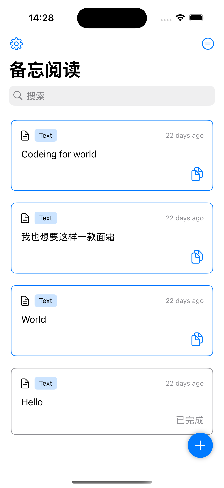
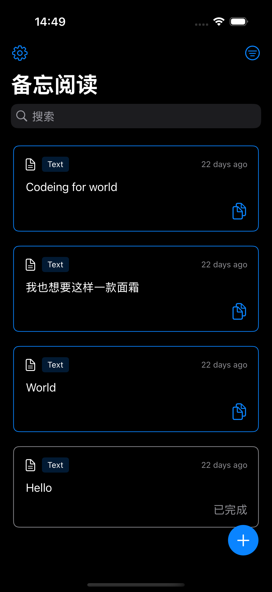
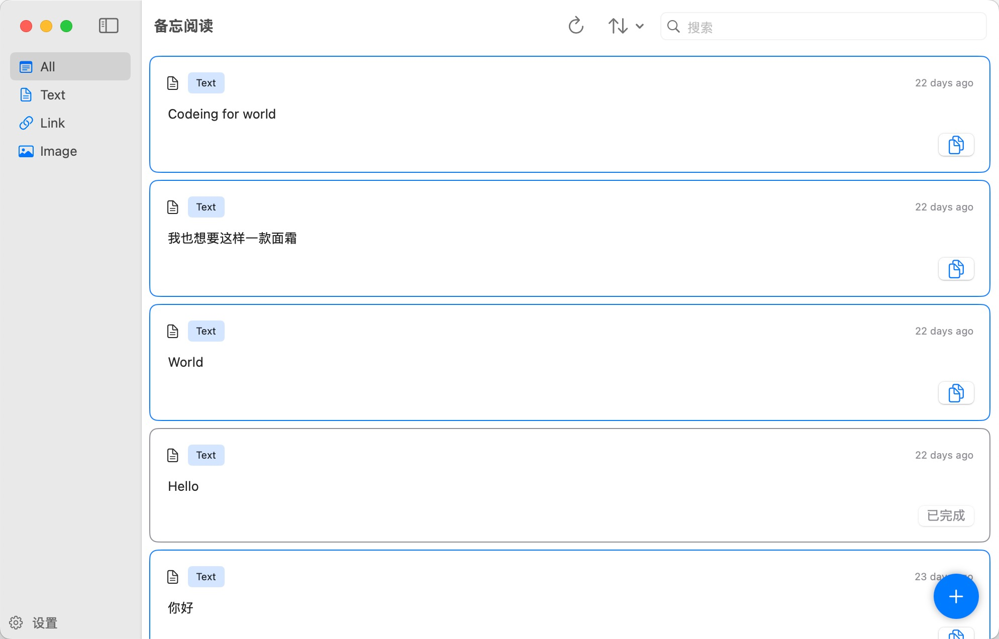

# MemoRead

> 一款优雅的跨平台阅读笔记应用，为您的阅读体验注入新活力

## 产品概览

MemoRead 是一款精心打造的阅读笔记应用，完美支持 iOS 和 macOS 平台。它通过现代化的原生界面设计和强大的数据同步能力，让您的阅读笔记管理更轻松、更高效。

### 界面预览

<table>
  <tr>
    <td align="center"><br/><sub><b>iOS 浅色模式</b></sub></td>
    <td align="center"><br/><sub><b>iOS 深色模式</b></sub></td>
  </tr>
</table>

<p align="center">
  <br/>
  <sub><b>macOS 界面</b></sub>
</p>

## ✨ 特色功能

### 📝 智能内容管理
- 多样化的内容保存方式，支持文本、图片和链接
- 专业的富文本编辑器，让笔记更生动
- 便捷的语音输入功能，解放双手
- 灵活的标签管理系统，轻松整理归类

### 🎨 精致界面设计
- 统一的代码基础，完美适配 iOS 和 macOS 原生风格
- 优雅的深色模式支持，保护您的眼睛
- 智能自适应布局，带来出色的跨设备体验

### ☁️ 无缝数据同步
- 可靠的 iCloud 同步，随时随地访问您的笔记
- 高效的本地存储机制，确保离线可用
- 专业的数据加密方案，保护您的隐私

## 🛠️ 技术架构

| 核心模块 | 技术选型 | 主要优势 |
|---------|---------|---------|
| 界面框架 | SwiftUI | 现代化的声明式 UI，实现跨平台代码复用 |
| 数据存储 | SwiftData | 高性能本地数据库，支持复杂数据关系 |
| 云同步 | CloudKit | 原生 iCloud 集成，智能网络状态管理 |

## 🚀 开始使用

### 环境要求

- 系统：iOS 15.0+ 或 macOS 12.0+
- 开发工具：Xcode 14.1+
- 其他：iCloud 账户（用于同步功能）

### 安装指南

1. 克隆代码仓库：
```bash
git clone https://github.com/DargonLee/MemoRead
```

2. 使用 Xcode 打开项目：
```bash
cd MemoRead
open MemoRead.xcodeproj
```

3. 配置开发者账号和 iCloud 权限

4. 编译并运行项目

## 📝 开发计划

- [ ] 支持更多文件格式
- [ ] 添加协作功能
- [ ] 优化离线性能
- [ ] 引入 AI 辅助功能

## 🤝 参与贡献

我们欢迎所有形式的贡献，无论是新功能、bug 修复还是文档改进。请查看我们的贡献指南了解更多信息。

## 📄 开源协议

本项目采用 MIT 协议开源，详见 [LICENSE](LICENSE) 文件。